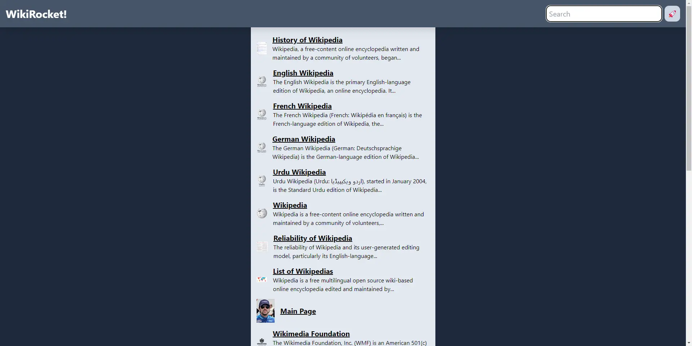

# WIKIROCKET

Simple clone of wikipedia using MediaWiki API - Following Tutorials from Dave Gray

## Screenshots



## Run Locally

Clone the project

```bash
  git clone https://github.com/ALauraOliva/NextSmallProject.git
```

Go to the project directory

```bash
  cd NextSmallProject
```

Install dependencies

```bash
  npm install
```

Run the app

```bash
  npm run dev
```

## Tech Stack

**Client:** React, Next, TailwindCSS

**Server:** Next

## Feedback

If you have any feedback, please reach out to us at andrea_carol00@hotmail.com
